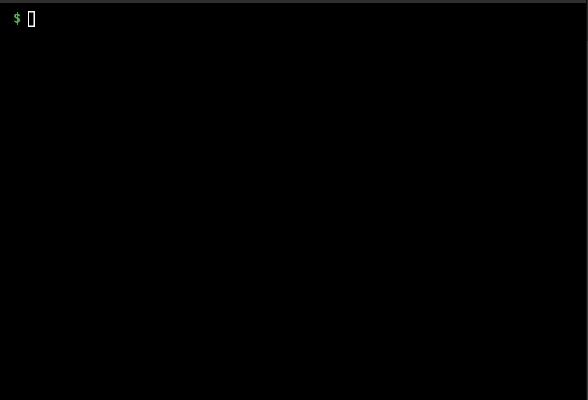
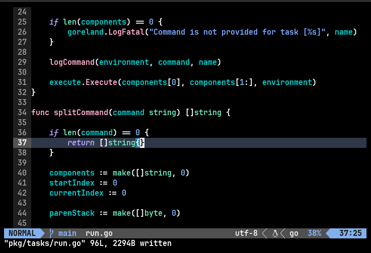

# 🧹 `groom`

`groom` is a yet another os-agnostic task runner.

<!-- TOC start (generated with https://github.com/derlin/bitdowntoc) -->

- [`groom`](#-groom)
   * [Features](#-features)
   * [Functionality](#functionality)
      + [Config file](#config-file)
      + [List](#list)
      + [Executing tasks](#executing-tasks)
      + [Neovim Plugin](#neovim-plugin)
   * [Contributing](#contributing)

<!-- TOC end -->
## ✨ Features

- 🔥 Task runner with a simple yet powerful toml syntax
- 🧹 Single static binary without dependencies
- 💻 Neovim plugin for integration with `neovim`.

## Functionality

### Config file

- Requires a simple `groom.toml` file in the project root.
- `groom` automatically recurses to the project root to find a `groom.toml` file.
- A global `[variables]` section for user variables.
- They support inline variable substition.

```toml
name = "example-project"

[variables]
version = "0.0.1"

# Tasks start with '[task.<task-name>]'
# They should contain, 'command' property.
# Other fields are optional.
[task.build]
description = "Build the project."
command = "go build ."

# Tasks can contain 'commands' as a list of commands.
[task.run]
commands = [
    "go run main.go",
    "python -m exaple-project",
]

# Tasks can contain dependencies, and environment variables defined
[task.test]
environment = [ "TESTS=1" ]
directory = "test"
command = "python -m unittest"
depends = [
    "format"
]

[task.format]
command = "go fmt ./..."
```

> You can run `groom --example-config` to get a working example config.


### Task

A `task` in `groom` needs a name and atleast a single command. 

This can be a task.

```toml
[task.some-name]
command = "echo 'Sample Task'"
```

It can contain
- Environment variables
    - List of environment variables with it's values as string.
- Task dependencies
    - List of dependencies which should be valid groom tasks.
- Multiple commands
    - List of commands to execute `sequentially`.
    - When `command` and `commands` both exist. `commands` takes precedence.
- Description
    - A single line describing the purpose of the task.
- Directory
    - A absolute path to change the working directory before executing the commands.

```toml
[task.build]
depends = [
    "format"
]
description = "Build the project"
directory = "src"
environment = ["DEBUG_BUILD=0"]
commands = [
    "gcc -c main.o main.c",
    "gcc -c game.o game.c",
    "gcc -o $name game.o main.o"
]

```

> Everything except `name` and `command` are optional

### List

Run `groom` without any arguments to list all configured tasks.

> Use `--simple` to list all tasks without any fancy printing. Useful with scripts.



### Executing tasks

Provide a list of tasks to execute and watch `groom` execute them!

>  Use the `--dry-run` argument to show the log without actually running anything.


### Neovim Plugin

A `neovim` plugin is in the works for integrating `groom` with Neovim.

It allows you to run tasks without leaving your editor.

> Find it [here](https://github.com/pspiagicw/groom.nvim)



## Contributing

⭐ Star the project if you like it!

Feel free to contribute to the project, by either raising a issue or opening a PR.
